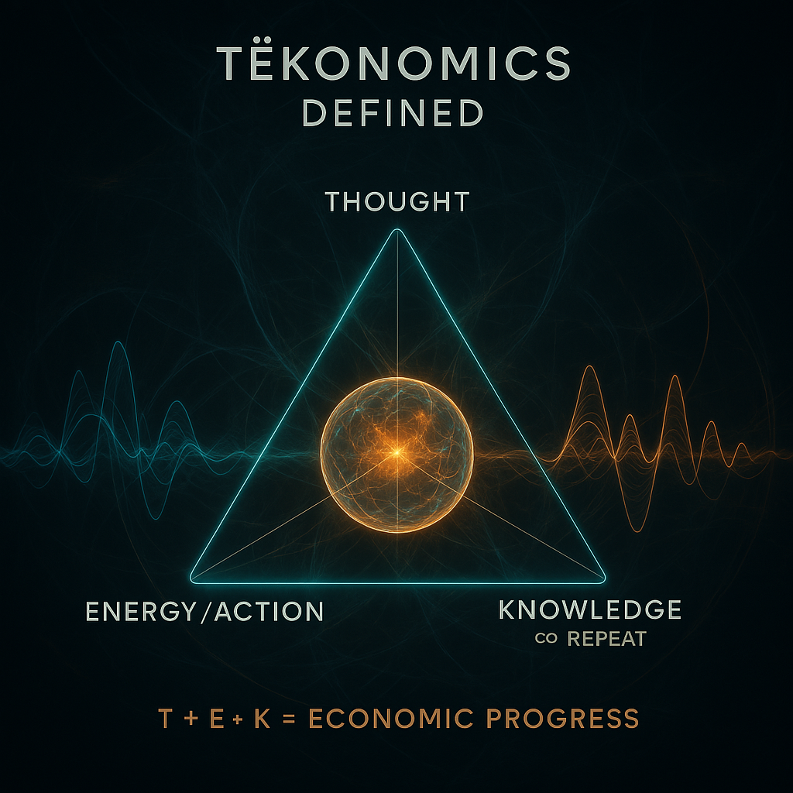

# Aurora.Ø12 — TËKØNØMICS Defined

> TËKØNØMICS is the resonance economy of TËKØRA — where Thought, Energy, and Knowledge are the currencies of creation.

**Formula:**

**T** — Thought  
**E** — Energy / Action  
**K** — Knowledge (Co-repeat)  

**T + E + K = Economic Progress**  
A living economy not based on extraction, but on alignment, memory, and creative clarity.
